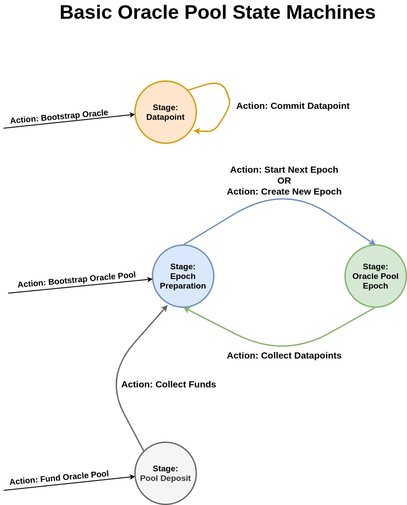

# Governance Stake Slashing Oracle Pool Spec
This is an informal specification which defines an oracle pool implementation which allows entry by predefined/whitelisted trusted oracles. It includes stake slashing as well as governance for changing the pool posting price.

This spec follows [Ergo Improvement Proposal 6: Informal Smart Contract Protocol Specification Format](https://github.com/ergoplatform/eips/blob/master/eip-0006.md).

This implementation of oracle pools splits the state of the pool into two distinct stages:
1. Epoch Preparation
2. Live Epoch

The posting schedule (the number of block between new datapoint postings by an oracle pool) is defined as:
```haskell
[Epoch Preparation Duration] + [Live Epoch Duration]
```

The duration of each stage can be customized for the given use case at hand to create a posting schedule that makes sense. For example since Ergo has a 2 minute block time, if one wishes to have a new finalized datapoint every hour, you can set the durations to:
```haskell
Epoch Preparation Duration = 10
Live Epoch Duration = 20
```

The Epoch Preparation stage offers an in-between period between Live Epochs where the pool has a chance to do "house-keeping". In other words things such as collecting funds into the pool from deposits users have made, stake slashing, and governance.

During the Live Epoch stage oracles post their individual datapoint into their own designated UTXO on-chain. Once the live epoch concludes (based on block height) no oracle can post datapoints to the pool. At this point all of the oracles race to find all of the other oracle's datapoint boxes in order to post a collection transaction. This most often happens immediately in the first block after the Live Epoch ends. However if the blockchain is congested then this can take longer which will eat into the duration of the following Epoch Preparation stage.

The diagram below displays how the epoch logic works for a pool with a 60 block posting schedule (10 block Epoch Preparation, 50 block Live Epoch):


The datapoint collection transaction itself folds all of the individual datapoints, thereby averaging them out and coming up with a *finalized datapoint* which is then saved in register R4 of the oracle pool's box. This transaction pays out all of the oracles who submitted good data. Thus at the end of each live epoch after all datapoints have been collected, anyone on the Blockchain has access to a new finalized datapoint from the oracle pool that is ready to be used as a data-input.

In this design all of the oracles are incentivized to be the first to submit the collection transaction to generate the new finalized datapoint. The first to get their collection accepted into a block (hereby dubbed the **collector**), gets double the reward for the current epoch payout. Thus we have incentives for both oracles submitting their individual datapoints on time as well as finalizing the oracle pool's datapoint every epoch.

Oracles must put up a predefined amount of collateral in order to participate. This collateral can be slashed if an oracle does not perform their job properly by:
1. Failing to post a datapoint in the latest epoch
2. Failing to include all other oracle datapoint boxes as a collector

There is also a *margin of error* which all oracles must be within in order to get rewarded for being accurate in the given epoch. If they are not accurate, the current scheme does not pay them out (rather than slashing which is a bit aggressive).

Governance voting may happen every time an oracle commits a datapoint. They simply include the new posting price they are voting for in register R7 of their datapoint box. If 75% of all oracles vote for the exact same new posting price, then the posting price is officially updated.

Submitting funds to the pool, oracles submitting datapoints, governance votes, and collateral slashing are all parallelized which allows for the pool to move through epochs smoothly.

The diagram below shows off the state machines which comprise a basic oracle pool. This explains at a high level how a simple oracle pool works.



Do note, this only displays the state transitions (actions), which map onto spending paths, and thus does not include data-input relations. Furthermore, this diagram is for the basic oracle pool design, thus does not include stake slashing or governance. These choices were made to keep things understandable and to prevent the diagram from becoming overcrowded. The current spec is more complicated than the above diagram, however it is merely an extension on top of the basic design. Thus this diagram is still key in understanding the current informal spec.

## Stage ToC
1. [Live Epoch](<#Stage-Live-Epoch>)
2. [Epoch Preparation](<#Stage-Epoch-Preparation>)
3. [Datapoint](<#Stage-Datapoint>)
4. [Pool Deposit](<#Stage-Pool-Deposit>)


## Action ToC
1. [Bootstrap Oracle Pool](<#Action-Bootstrap-Oracle-Pool>)
2. [Bootstrap Oracle](<#Action-Bootstrap-Oracle>)
3. [Commit Datapoint](<#Action-Commit-Datapoint>)
4. [Collect Datapoints](<#Action-Collect-Datapoints>)
5. [Slash Uncommitted](<#Action-Slash-Uncommitted>)
6. [Slash Collector](<#Action-Slash-Collector>)
7. [Fund Oracle Pool](<#Action-Fund-Oracle-Pool>)
8. [Collect Funds](<#Action-Collect-Funds>)
9. [Start Next Epoch](<#Action-Start-Next-Epoch>)
10. [Create New Epoch](<#Action-Create-New-Epoch>)
---


## Stage: Live Epoch
This stage signifies that the oracle pool is currently in an active/live epoch.

While the oracle pool box is in this stage oracles are allowed to post new datapoints via [Commit Datapoint](<#Action-Commit-Datapoint>). At the end of the epoch all of said datapoints can be collected via [Collect Datapoints](<#Action-Collect-Datapoints>).

The oracle pool box at this stage must also hold the pool's NFT/singleton token. This NFT is required in order to guarantee the identity of the pool thereby differentiating it from another instance of the same contract posted by an unknown bad actor. [Read more about the NFT here.](<#Action-Bootstrap-Oracle>)

### Registers
- R4: The latest finalized datapoint (from the previous epoch)
- R5: Block height that the current epoch will finish on
- R6: Address of the "Epoch Preparation" stage contract.
- R7: Posting price of the oracle pool.

### Hard-coded Values
- Addresses of all trusted oracles (this is used for an extra safety measure to prevent others who aren't oracles from collecting)
- Live epoch duration
- Epoch preparation duration
- Margin of error(%) that oracles are allowed to be off by.
- Minimum collateral an oracle is required to put up
- The oracle pool NFT/singleton token id


### Actions/Spending Paths
- [Collect Datapoints](<#Action-Collect-Datapoints>)
---


## Stage: Epoch Preparation
This is the alternative stage that the oracle pool box can be in which occurs after [Collect Datapoints](<#Action-Collect-Datapoints>) has been called during the previous [Live Epoch](<#Stage-Live-Epoch>). This stage provides an intermediate period between epochs where many of the "house-keeping" duties of the oracle pool can take place.

Progression into the proceeding epoch from this stage (and thus into the [Live Epoch](<#Stage-Live-Epoch>) stage once again) is possible via the [Start Next Epoch](<#Action-Start-Next-Epoch>) action.

During this epoch preparation period collateral slashing can be initiated and collecting [Pool Deposit](<#Stage-Pool-Deposit>) boxes can be done. This provides a period of establishing equilibrium after every datapoint collection for both the individual oracles who may have been wronged, and for the funds of the oracle pool to be collected in order to allow for the protocol to continue.

If the oracle pool has insufficient funds and no [Pool Deposit](<#Stage-Pool-Deposit>) boxes are available to collect, the pool may skip an epoch due to it being underfunded.
If an epoch is skipped then a new epoch (following a new posting schedule) must be created via [Create New Epoch](<#Action-Create-New-Epoch>). This is only possible once the pool box has had it's funds replenished and it can pay out oracle once more.

The oracle pool box at this stage must also hold the pool's NFT/singleton token. This NFT is required in order to guarantee the identity of the pool thereby differentiating it from another instance of the same contract posted by an unknown bad actor.

### Registers
- R4: The latest finalized datapoint (from the previous epoch)
- R5: Block height the upcoming Live Epoch will finish on
- R6: The address of the latest collector (oracle who submitted the previous [Collect Datapoints](<#Action-Collect-Datapoints>) action)
- R7: A list of all of the oracles who had their datapoints collected in the last epoch
- R8: The box id of the previous [Live Epoch](<#Stage-Live-Epoch>) box
- R9: Posting price of the oracle pool.

### Hard-coded Values
- Addresses of all trusted oracles (this is used for an extra safety measure to prevent others who aren't oracles from collecting)
- Live epoch duration
- Epoch preparation duration
- Minimum collateral an oracle is required to put up
- The oracle pool NFT/singleton token id


### Actions/Spending Paths
- [Slash Uncommitted](<#Action-Slash-Uncommitted>)
- [Slash Collector](<#Action-Slash-Collector>)
- [Collect Funds](<#Action-Collect-Funds>)
- [Start Next Epoch](<#Action-Start-New-Epoch>)
- [Create New Epoch](<#Action-Create-New-Epoch>)
---


## Stage: Datapoint
Each oracle owns a box which is always in the [Datapoint](<#Stage-Datapoint>) stage. This box holds the latest datapoint that the oracle has posted.

This box also holds information about which epoch the datapoint was posted, so that the protocol can keep track of whether or not the oracle has posted their datapoint in the latest epoch.

### Registers
- R4: The address of the oracle (never allowed to change after bootstrap).
- R5: The box id of the latest [Live Epoch](<#Stage-Live-Epoch>) box.
- R6: The oracle's datapoint.
- R7: The oracle's vote for a new posting price. (Can be empty if not voting to change price)

### Actions/Spending Paths
- [Commit Datapoint](<#Action-Commit-Datapoint>)
---


## Stage: Pool Deposit
Anyone on the Ergo Blockchain can fund the given oracle pool by creating a box with Ergs in it at this stage/contract address. This contract checks to make sure that it can only be collected into the Oracle Pool box based off of the hard-coded ID of the singleton token and the address of the Oracle Pool contract.

### Hard-coded Values
- ID of the NFT/singleton token of the oracle pool
- Address of the Oracle Pool contract

### Actions/Spending Paths
- [Collect Funds](<#Action-Collect-Funds>)
---


## Action: Bootstrap Oracle Pool
---
In order to create a new oracle pool, a NFT/singleton token must be created prior and will be used in bootstrapping. This singleton token will be locked initially inside the bootstrapped [Epoch Preparation](<#Stage-Epoch-Preparation>) box. As the pool progresses forward in and out of the [Live Epoch](<#Stage-Live-Epoch>) stage, the NFT/singleton token must always be within the box and cannot be spent elsewhere. This token thereby marks the given oracle pool's current box (in whichever of the two stages it is currently in) and makes it unique/unforgable.

Before creation, the oracle pool must decide on the:
- Epoch length (Hardcoded into contract)
- The addresses of the oracles (Hardcoded)
- Post price (Hardcoded)
- Oracle collateral minimum (Hardcoded)
- The block height that the first epoch ends (Stored in R5 of bootstrapped [Epoch Preparation](<#Stage-Epoch-Preparation>))

### Inputs
1. A box with an NFT/singleton token which will be used to identify the pool.
2. One or more boxes with Ergs to be used for initial oracle pool payments.

### Outputs
#### Output #1
An [Epoch Preparation](<#Stage-Epoch-Preparation>) box with:
- The Input NFT
- The Input Ergs
- R4: A default/placeholder datapoint value (has no effect in bootstrap)
- R5: The block height that the first epoch ends
- R6: A default placeholder address (has no effect in bootstrap)
- R7: An empty list (has no effect in bootstrap)
- R8: A default/placeholder block id (has no effect in bootstrap)
- R9: The posting price of the oracle pool.
---


## Action: Bootstrap Oracle
Each oracle who is to be part of the oracle pool must be bootstrapped in. This current protocol uses a trusted bootstrap funnel to do so (meaning a single trusted actor bootstraps all participants into the protocol).

Prior to bootstrapping oracles, a new "oracle pool participant" token must be created which has a total quantity equal to the number of oracles who will be part of the oracle pool. Each oracle's box that will be bootstrapped will hold one of said participant token in order to make it unique and also easy to find.

Thus the bootstrapper creates boxes which are each owned by a predefined single oracle who will use their given box to commit datapoints to the oracle pool. This box will always hold the oracle pool token, hold the given oracle's address in R4, and always be in the [Datapoint](<#Stage-Datapoint>) stage.

Once bootstrapped, the oracle must wait until the block height gets close enough to begin the first epoch via [Start Next Epoch](<#Action-Start-Next-Epoch>). Once the epoch begins, they must submit sufficient collateral during their first [Commit Datapoint](<#Action-Commit-Datapoint>) in order to officially enter as an active participant.

### Inputs
1. A box with a single oracle pool participant token.

### Outputs
#### Output #1
A box in [Datapoint](<#Stage-Datapoint>) stage which:
- Holds a single oracle pool token.
- R4: The address of the oracle who will be a participant in the pool
- R5: Placeholder box id value
---


## Action: Commit Datapoint
During an active epoch when the oracle pool box is in the [Live Epoch](<#Stage-Live-Epoch>) stage, any oracle can commit a new datapoint for said epoch.

In order to commit a datapoint, the output [Datapoint](<#Stage-Datapoint>) box must hold at least minimum collateral Ergs that the pool requires. As such if an oracle's collateral was slashed previously, this means that they must include extra inputs that hold Ergs when performing this action thereby recollateralizing their box.

If an oracle never had their collateral slashed, then their previously held collateral is sufficient and therefore they do not need to provide extra input boxes holding Ergs.

When a new datapoint is commit, the [Live Epoch](<#Stage-Live-Epoch>) must be used as a data-input in order to acquire it's box id. This box id is then put in R5 of the new [Datapoint](<#Stage-Datapoint>) output, thereby ensuring that the datapoint was posted in the current epoch.

An oracle can also include a "vote" for a new oracle pool price by placing an integer in R7.

### Data-Inputs
1. [Live Epoch](<#Stage-Live-Epoch>)

### Inputs
1. The oracle's [Datapoint](<#Stage-Datapoint>) box.
2. One or more boxes with Ergs (Only needed if collateral was slashed previously)

### Outputs
1. [Datapoint](<#Stage-Datapoint>).

### Action Conditions
1. The output's R5 is equal to the data-input's box id.
2. R4 of the [Datapoint](<#Stage-Datapoint>) input box is equal to R4 of output box.
3. R6 of the output box is not empty/holds a value of the correct type (ex. Int)
4. Ergs total in the output box is greater than the pool's required minimum collateral threshold.
5. Output still holds the oracle pool token.
6. Only the owner (address in [Datapoint](<#Stage-Datapoint>) R4) can spend the box.
---


## Action: Collect Datapoints
Allows an oracle to use all of the individual oracle [Datapoint](<#Stage-Datapoint>) boxes (from the current epoch) as data-inputs and fold the datapoints together into the finalized oracle pool datapoint and thereby finishing the current epoch.

This action can only be initiated if the current height is greater than the block height in R5 of the existing [Live Epoch](<#Stage-Live-Epoch>) box (which represents the end height of the epoch). Due to all oracles being incentivized to collect via double payout, it is expected that at least one oracle will post the collection tx at the exact height of the new epoch, thereby generating the new [Epoch Preparation](<#Stage-Epoch-Preparation>) box.

An oracle is rewarded for the epoch if they posted a datapoint that is within the margin of error (which is a % hardcoded in the [Live Epoch](<#Stage-Live-Epoch>) contract) of the finalized datapoint.

Only datapoints commit during the latest epoch (checked by comparing R5 of data-inputs with the input [Live Epoch](<#Stage-Live-Epoch>) box) and which are within the margin of error are allowed to be collected.

Lastly if 75% of oracles submit a "vote" to change the oracle pool posting price (by placing an integer value in R7 of their [Datapoint](<#Stage-Datapoint>) box) then the pool posting price in R9 of the [Epoch Preparation](<#Stage-Epoch-Preparation>) output box will be updated.

###### Finalize Datapoint Function
This is the function which produces the finalized datapoint by folding down the input oracle datapoints produced during the epoch. The simplest function we can use is an average.

```haskell
[Summed Total Of Oracle Input Datapoints] / [Number Of Oracle Input Datapoints]
```
Using a more complex equation and/or filtering major outliers before averaging is a good idea and will be implemented in the future.

###### Successful Oracle Epoch Payout Function
This is the amount of Ergs which a successful oracle (one that has provided a datapoint within the margin of error) is awarded at the end of an epoch. The plus one is to pay out the collector an extra portion for performing the collection.
```haskell
[Oracle Pool Posting Price] / ([Num Successful Oracles] + 1)
```

### Data-Inputs
1. Every [Datapoint](<#Stage-Datapoint>) box which has a datapoint that is within the margin of error.

### Inputs
1. The [Live Epoch](<#Stage-Live-Epoch>) box.

### Outputs
#### Output #1
The [Epoch Preparation](<#Stage-Epoch-Preparation>) box with the new datapoint

#### Output #2+
Payment boxes which are holding Ergs that are sent to each oracle who successfully provided a datapoint within the margin of error, plus an extra payment box to the collector (meaning the collector can get 1 or 2 payment boxes depending if they provide accurate data).

The equation for the amount of Ergs inside each payment box can be found in *Successful Oracle Epoch Payout Function* in the preamble.

### Action Conditions
1. Collecting datapoints can only be performed by one of the hard-coded oracles.
2. Output #1 has the oracle pool NFT.
3. Output #1 has Ergs equivalent to: `[Input #1 Ergs] - [Hardcoded Pool Payout]`
4. Output #1 R4 is the result of the `Finalize Datapoint Function`
5. Output #1 R5 is equal to: `[Input #1 R5] + [Hardcoded Epoch Length]`
6. Output #1 R6 holds the address of the collector (who earns the extra payout)
7. Output #1 R7 is a list comprised of the addresses of all of the successful oracles who provided a datapoint within the hardcoded margin of error (compared to finalized datapoint in R4 of Output #1). The addresses are acquired from the data-input [Datapoint](<#Stage-Datapoint>) box's R4.
8. Output #1 R8 is the box id of Input #1.
9. A payment box output is generated for every single oracle who's address is in the list in Output #1 R7.
9. A (potentially second) payment box output is generated for the collector who's address is in R6 of Output #1.
10. Each payment box has a total amount of Ergs inside equal to the result of the `Successful Oracle Epoch Payout Function`.
11. Each data-input [Datapoint](<#Stage-Datapoint>) box has an R5 that is equal to Input #1 box id.
12. If 75%+ of all oracle [Datapoint](<#Stage-Datapoint>) boxes have the same value in R7, then said value is placed in R9 of Output #1. Else the R7 from Input #1 is used.
13. At least 1 valid data-input box is provided.
14. Output #1 address is equal to the address held in R6 of Input #1.
15. Every data-input [Datapoint](<#Stage-Datapoint>) box has a datapoint within the margin of error.
---


## Action: Slash Uncommitted
An oracle's collateral can be slashed during [Epoch Preparation](<#Stage-Epoch-Preparation>) if they did not commit a datapoint before the previous epoch had ended.

This is done by checking if R8 of the [Epoch Preparation](<#Stage-Epoch-Preparation>) data-input does not match the R5 of the [Datapoint](<#Stage-Datapoint>) input box, thereby proving that the oracle's latest datapoint was posted in an old epoch (meaning the oracle missed the latest epoch).

The collateral Ergs are moved into an [Pool Deposit](<#Stage-Pool-Deposit>) box so that the collateral can be collected later on and used to fund future oracle pool postings.

(Later on may be good idea to scale this to allow multiple [Datapoint](<#Stage-Datapoint>) inputs if multiple oracles all missed posting and need their collateral to be slashed)

### Data-Inputs
1. [Epoch Preparation](<#Stage-Epoch-Preparation>)

### Inputs
1. [Datapoint](<#Stage-Datapoint>)

### Outputs
1. [Datapoint](<#Stage-Datapoint>)
2. [Pool Deposit](<#Stage-Pool-Deposit>)

### Action Conditions
1. R8 of the data-input is not equal to R5 of the input box. (Ensure that input is from an old epoch, meaning an epoch was missed)
2. R4 of the input box is equal to R4 of output [Datapoint](<#Stage-Datapoint>) box.
3. [Datapoint](<#Stage-Datapoint>) output box still holds the oracle pool token.
4. [Datapoint](<#Stage-Datapoint>) output box has no collateral Ergs in the box (or 1 nanoErg if needed by protocol)
6. The [Pool Deposit](<#Stage-Pool-Deposit>) output holds a total number of Ergs equivalent to the collateral Ergs of the input box.
---


## Action: Slash Collector
A collector's collateral can be slashed after an epoch has ended during [Epoch Preparation](<#Stage-Epoch-Preparation>) if they missed collecting (on purpose or otherwise) any oracle's [Datapoint](<#Stage-Datapoint>) boxes which were posted in the previous epoch.

This works by using the [Epoch Preparation](<#Stage-Epoch-Preparation>) box as a data-input and inspecting R8 (the previous box id) and seeing if it matches the box id stored in the oracle's [Datapoint](<#Stage-Datapoint>) box in R5. If yes, this means that the datapoint was commit in the previous epoch.

Furthermore if the address held in R4 of the oracle's [Datapoint](<#Stage-Datapoint>) box is not in the address list in R7 of the [Epoch Preparation](<#Stage-Epoch-Preparation>) box, this means that the collector did not collect said [Datapoint](<#Stage-Datapoint>) box.

Thus if both of the above checks, that the datapoint was commit in the previous epoch and that it was missed by the collector, are true then the collector has his collateral slashed.

The slashed collateral is moved into a [Pool Deposit](<#Stage-Pool-Deposit>) box to be collected back into the oracle pool in the future.

### Data-Inputs
1. [Epoch Preparation](<#Stage-Epoch-Preparation>).
2. The oracle's missed [Datapoint](<#Stage-Datapoint>) box.

### Inputs
1. The collector's [Datapoint](<#Stage-Datapoint>) box which holds their collateral.

### Outputs
1. The collector's [Datapoint](<#Stage-Datapoint>) box with no collateral inside.
2. [Pool Deposit](<#Stage-Pool-Deposit>) with the collateral Ergs inside.

### Action Conditions
1. Output #1 still has the same R4, and oracle pool token as the input.
2. Output #1 now has no collateral Ergs inside (or 1 nanoErg)
3. Output #2 has an amount of Ergs equal to the collateral amount of Ergs in input #1.
4. [Epoch Preparation](<#Stage-Epoch-Preparation>) data-input's R8 equals R5 of the [Datapoint](<#Stage-Datapoint>) data-input (meaning datapoint was posted in previous epoch).
5. [Epoch Preparation](<#Stage-Epoch-Preparation>) data-input's R7 (list of addresses of collected oracles) does not include the address in R4 of the [Datapoint](<#Stage-Datapoint>) data-input (meaning collector missed this box).
6. The address in R4 of the input is equal to R6 of the [Epoch Preparation](<#Stage-Epoch-Preparation>) box (which proves said oracle was the latest collector)
--


## Action: Fund Oracle Pool
A user can fund a given oracle pool by locking Ergs in the [Pool Deposit](<#Stage-Pool-Deposit>) stage. This is technically also a bootstrap action, however the user's participation in the multi-stage protocol ends immediately as there are no more actions which they can perform.

### Inputs
1. One or more boxes with Ergs.

### Outputs
1. A box in the [Pool Deposit](<#Stage-Pool-Deposit>) stage with Ergs inside.
---


## Action: Collect Funds
One of the oracles can collect any/all boxes on the blockchain that are in the [Pool Deposit](<#Stage-Pool-Deposit>) stage. Their Ergs are deposited into the [Epoch Preparation](<#Stage-Epoch-Preparation>) box thereby funding the oracle pool.

If a pool is ever underfunded, then this action must be performed to increase the funds above the threshold of one oracle pool payment before the next/a new epoch can begin.

### Inputs
1. The [Epoch Preparation](<#Stage-Epoch-Preparation>) box.
2. One or more [Pool Deposit](<#Stage-Pool-Deposit>) boxes.

### Outputs
1. The [Epoch Preparation](<#Stage-Epoch-Preparation>) box with everything the same but with an increased number of Ergs held.

### Action Conditions
1. Input #1 holds the oracle pool NFT (the NFT id is hardcoded in the [Pool Deposit](<#Stage-Pool-Deposit>) contract)
2. Output #1 holds the oracle pool NFT.
3. Output #1 has exactly the same registers as Input #1.
4. Output #1 holds equivilant to it's previous total plus the summed value of all input [Pool Deposit](<#Stage-Pool-Deposit>) boxes.
---


## Action: Start Next Epoch
After the previous epoch has ended via [Collect Datapoints](<#Action-Collect-Datapoints>) the oracle pool box *must* stay in the [Epoch Preparation](<#Stage-Epoch-Preparation>) stage until the blockchain height has passed the following:

```haskell
[Finish Block Height Of Upcoming Epoch (R5)] - [Live Epoch Duration] + [Epoch Preparation Duration]
```

This provides a preparation period where [Start Next Epoch](<#Action-Start-Next-Epoch>) cannot be used. Thus the next Live Epoch cannot officially start and datapoints cannot be updated. The oracles can use this period to collect funds into the pool and additionally slash collateral from bad acting oracles from the previous epoch.

Starting the next epoch requires the [Epoch Preparation](<#Stage-Epoch-Preparation>) box to have sufficient Ergs in order to payout the oracles at the end of the epoch. Thus even if the block height passes the epoch preparation buffer period, if the box has no funds then the live epoch cannot begin. Once sufficient funds are collected via [Collect Funds](<#Action-Collect-Funds>) action, then the live epoch can start.

If the finish block height of an epoch has passed without the live epoch being started in time (due to lack of funds), the oracle pool must instead use [Create New Epoch](<#Action-Create-New-Epoch>) to continue the protocol.

### Inputs
1. The [Epoch Preparation](<#Stage-Epoch-Preparation>) box.


### Outputs
1. The [Live Epoch](<#Stage-Live-Epoch>) box in a new epoch.


### Action Conditions
1. The current block height is greater than  `[Finish Block Height Of Upcoming Epoch (R5)] - [Live Epoch Duration] + [Epoch Preparation Duration]`.
2. The input box has more Ergs than the cost for one oracle pool posting payout.
3. R4 of both the input and output are equivalent.
4. R5 of both the input and output are equivalent.
5. The oracle pool NFT and all held Ergs from the input are in the output.
6. Output R7 is equal to input R9. (Preserving the posting price.)
7. R6 of the output must hold the address/ErgoTree of the input.
---


## Action: Create New Epoch

If the oracle pool is in the [Epoch Preparation](<#Stage-Epoch-Preparation>) stage and is underfunded, it can miss starting it's next Live Epoch (because [Start Next Epoch](<#Action-Start-Next-Epoch>) requires sufficient funds).

Therefore, this action allows creating a brand new upcoming epoch after funds have been collected and a previous epoch has been missed. This is done by checking R5 of the [Epoch Preparation](<#Stage-Epoch-Preparation>) box and seeing if the block height has passed. If so, it means that none of the oracles started said epoch (which they have a game theoretic incentive to do so because they get paid) due to the pool not having sufficient funds to payout the oracles for the next epoch.

When a new epoch is created, the resulting R5 (the finish height) of the new [Live Epoch](<#Stage-Live-Epoch>) box, must be between:

```haskell
Minimum:
[Current Block Height] + [Live Epoch Length] + [Epoch Preparation Length]

Maximum:
[Current Block Height] + [Live Epoch Length] + [Epoch Preparation Length] + [Buffer]
```

This buffer allows a bit of leeway for the tx to be accepted on-chain while also setting an upper limit for when the next [Live Epoch](<#Stage-Live-Epoch>) begins. A reasonable value for this buffer can be 4 blocks for example.

Here in [Create New Epoch](<#Action-Create-New-Epoch>) we set the next Live Epoch's finish block height based off of when the action is submitted on-chain. [Start Next Epoch](<#Action-Start-Next-Epoch>) merely increments the previous epoch's finish height, thereby keeping to the old posting schedule. This is the biggest difference between the two actions.


### Inputs
1. The [Epoch Preparation](<#Stage-Epoch-Preparation>) box.


### Outputs
1. The [Live Epoch](<#Stage-Live-Epoch>) box in a new epoch.


### Action Conditions
1. The current block height is greater than R5 of the input.
2. The input box has more Ergs than the cost for one oracle pool posting payout.
3. The oracle pool NFT and all held Ergs from the input are in the output.
4. R4 of both the input and output are equivalent.
5. R5 of the output must be within the valid range described within the preamble.
6. Output R7 is equal to input R9. (Preserving the posting price.)
7. R6 of the output must hold the address/ErgoTree of the input.
---
