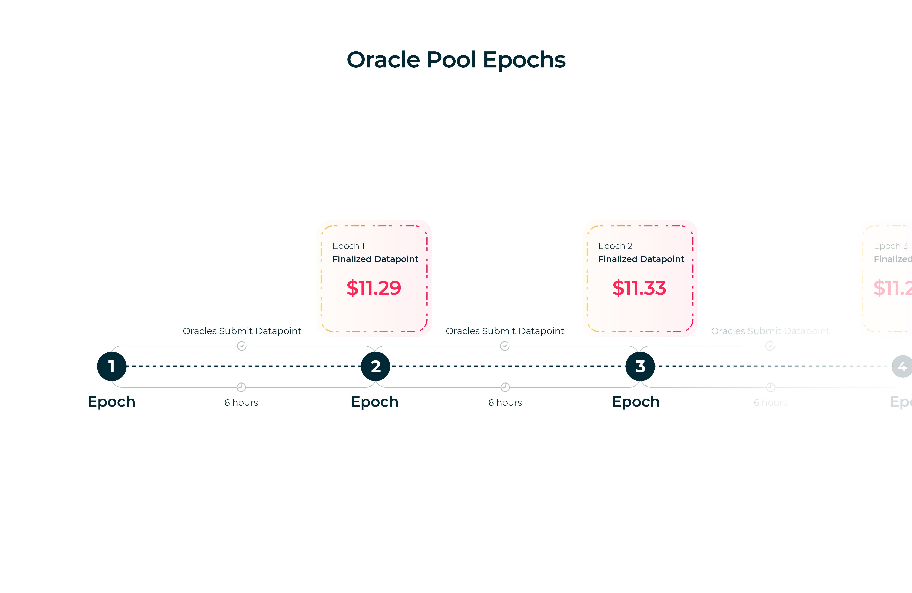
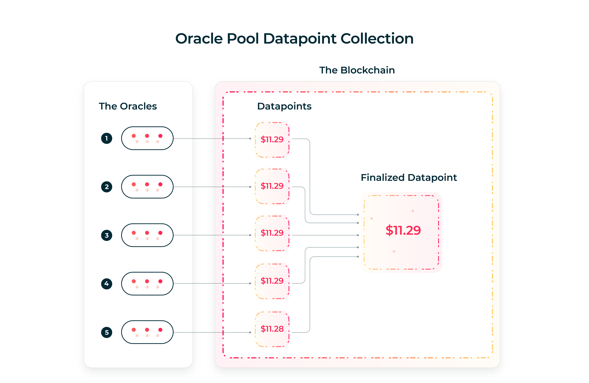
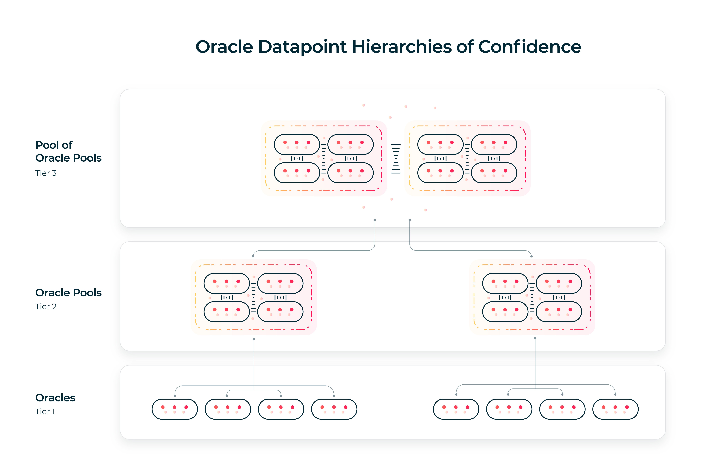

# Oracle Pools

- Author: Robert Kornacki
- Released: June 26 2020
- Topics: Oracles, DeFi, Incentives

Introduction
--- 

Oracles are a key element in the growing sphere of DeFi with new use cases being discovered constantly. However as pointed out in the recent paper, [A First Look into DeFi Oracles](https://arxiv.org/abs/2005.04377), oracles schemes today lack transparency, accountability, and operational robustness.

Oracle pools are a new model which attempt to address said issues, while also providing further new capabilities. From guaranteeing the data posting schedule, incorporating game theoretic incentives + disincentives, built-in governance, potential dynamic entry, and building oracle datapoint hierarchies of confidence, there are many possibilities unlocked with this model.

The idea of oracle pools spawned during explorations into DeFi with the novel extended UTXO smart contract model. The ability to easily reference or spend tokens/data inside of other UTXOs provided a natural framework for developing this new type of oracle protocol. That said, this document is a high-level overview of oracle pools and thus should still be useful as a reference for those who wish to attempt implementing oracle pools in account-based systems (though some redesigning is likely required and not all of the potential benefits outlined in this document may be possible).

Oracle Pool Basics
---

In short, an oracle pool is comprised of a group of oracles that decide to source the same piece of data. This data may be a specific datapoint from a given provider, or be a pre-agreed upon accumulated datapoint from several sources which is folded down into a single value by each oracle before being posted onto the blockchain.

Every oracle pool has a posting schedule. This is the amount of time (in blocks/slots) which passes in between the oracle pool finalizing/posting new datapoints that are ready to be used.

The period between oracle pool datapoint postings, where oracles part of the pool are allowed to submit their own datapoints, is called an epoch. At the end of an epoch (which coincides with the posting schedule), all of the submitted datapoints get accumulated together and finalized into a single new pool datapoint (based on filtering outliers, averaging all oracle datapoints, etc). 

Each oracle pool has a posting price. This is the price (in whatever token/currency the oracles agree upon) that a single pool datapoint post costs. Furthermore each pool has a UTXO which holds the pool's funds. Every time a new finalized datapoint is posted by the oracle pool, the posting price amount of currency is withdrawn from the pool funds and dispersed to the oracles who submitted good datapoints.

If an oracle failed to submit a datapoint, or submit a datapoint which was an outlier/off by some predefined margin of error, that oracle does not get paid out (and can potentially gets their stake slashed, which we will cover in more depth later on).

If an oracle pool ever becomes underfunded, meaning that their funds are below the posting price, then oracles do not post datapoints for the given epoch (as they cannot be paid for doing said service). As such, the pool must be funded in order to maintain a steady stream of data, or to restart an oracle pool which has become underfunded. This can be done by anyone via depositing funds which get collected into the oracle pool's UTXO.

Lastly, the oracle which collects all of the datapoints (dubbed the *collector*) from their separate UTXOs and accumulates them into the finalized datapoint for the given epoch is paid double. This incentivizes all oracles to race to post the collection tx, and thereby ensures that oracle pool datapoint postings are always timely.

Thus oracle pools provide a predictable and steady stream of oracle data which is averaged out from several oracles while providing an easy way to fund said service tied together with game theoretic incentives.

This is the simplest conception of an oracle pool and in the following sections we will begin to explore how we can build off of this base to provide better assurance, flexibility, and further novel unexplored potential.

Note, a given oracle pool implementation must at least support the above basic design to be considered an oracle pool, however the following extensions to the core basic oracle pool protocol can be selectively chosen for a given use case.

Stake Slashing
---
While incentives are a useful tool to promote good actions within the protocol, disincentives are required as well. As such we can implement stake slashing into the oracle pool model.

Every oracle who joins a given oracle pool is required to submit collateral of at least the minimum amount required by the pool at hand. This amount is defined prior to the launch of the oracle pool and is likely to be hard-coded (though can also be controlled by governance if so desired).

An oracle is only allowed to submit datapoints, and thus earn coins for doing their job, if they have sufficient collateral. They are barred from submitting datapoints on the smart contract protocol level if they do not have sufficient collateral submitted.

Assuming that an oracle has submitted collateral, this collateral can be slashed if they:
1. Failed to submit a datapoint in the previous epoch
2. Failed to collect all datapoints (missed one or more other oracle datapoints, whether on purpose or by mistake)
3. Submit a datapoint that is an outlier (meaning that their provided value was considerably off when compared to the average, meaning their is a problem in their datapoint sourcing)

As such, oracles inside of an oracle pool are harshly penalized for failing to do their job properly, no matter if it was by mistake or purposely malicious. The collateral amount should be significantly larger than the datapoint posting payment in order to keep things in balance.

Governance Voting
---
Governance can also be added to an oracle pool in order to ensure longevity and add extra flexibility. For example, in cases where the value of the payment coin/token fluctuates vastly, it can be helpful to adjust the posting price or the required collateral.

#### Governance Of Parameters
The first type of governance available for oracle pools is parameter governance. All key parameters of the oracle pool can be changed by a 75% agreement. For example:

1. The posting price
2. The epoch length/posting schedule
3. Minimum required collateral
4. Number of oracles allowed to be part of pool

Every parameter change requires an oracle to post the expected parameter value as a part of their vote. If a 75%+ majority vote for the same new parameter value, then it is accepted and set for the next new epoch.

It is a good idea for oracles pool implementations to also restrict the amount by which a parameter can change. For example, limiting posting price changes to maximum 1% per epoch, and/or potentially setting hard maximum/minimum values.

Thus the oracle pool can adapt overtime to the requirements needed of it through parameter voting. 

#### Governance Of Entry
Furthermore, instead of just parameter changes, we can incorporate governance-based entry into an oracle pool.

Existing oracles can vote for a specific address which will have the right to join the protocol and be an official oracle inside of said oracle pool.

This needs to be done with great caution however, as this would also allow said oracle to gain voting rights as well. If a pool is not careful this can have disastrous consequences with bad actors entering the fold. It is possible to encode a "cooling off" period of time where a new oracle does not have voting rights, and can be removed based off of a majority vote.

#### Voting Period
Governance voting can be encoded within the protocol at one of two periods.
1. Joint together with the submission of the oracle's datapoint.
2. In between epochs during a "down time" where datapoints are not being submitted.

The former allows for a very streamlined method of voting. Whenever a datapoint is posted by an oracle, they also provide their vote together. At the end of the epoch when the datapoints are collected, the votes are inherently also collected. Thus if a majority of oracles who submitted datapoints in said epoch all cast the same vote, then the governance action can be initiated. One downfall here is that adding governance with the collection increases the complexity & cost of the collection transaction.

The latter on the other hand provides the ability for governance to be more complex because it is cleanly separated. Both have their merits and may each be useful depending on the use case.

#### External Actor Voting
Typically the oracles are the group of actors who have voting rights in the governance structure, however it is also possible for external actors to also have a say in governance of the pool.

This can be made possible by minting governance tokens for a given oracle pool together with the in-between epoch design pattern for voting. This therefore allows pools to be created where solely external actors are allowed to vote on changes, or pools where both oracles and external actors have the right to take part in governance.

Each individual who votes must cast their vote by using their governance token, no matter if they are an oracle or a 3rd party. As long as they hold the governance token they have the right to create a UTXO with their vote (for changes to be made to the oracle pool). As such, once a sufficient number of votes are submit, they can be collected back into the core smart contract protocol and applied going into the next epoch.

Oracle Pools As Core Infrastructure
---
One of the great things about oracle pools on top of extended UTXO systems (which support data-inputs) is that everyone on the network can benefit from utilizing the same oracle pool for a given datapoint. 

Rather than each dApp creating it's own price feed made of custom oracles & accumulator contracts, the blockchain ecosystem can focus on creating large oracle pools which provide a highly accurate and trustworthy data source. Thanks to incentives being a key part of oracle pools (especially with collateral slashing), the larger the set of oracles which take part, the harder it is for a subset of the oracles to go rogue and try to disrupt the system.

Since oracle pool postings are on a schedule and provide publicly available data in a UTXO, this means that oracle pools act as a public good for all users on the network. Thus even tiny p2p dApps, which only involve 2 participants, still have the ability to utilize the oracle pool datapoints for free by using the pool UTXO as a data-input. This potentially has a waterfall effect in aiding the development of the dApp ecosystem as the barrier of entry for new developers shrinks. Oracle pool datafeeds can one day become commonplace and the equivalent of public/core infrastructure.

Thanks to the UTXO model, any dApp can trivially aid in funding an oracle pool to guarantee non-stop data posting (so that the pool never becomes underfunded). The smart contracts of the dApp can simply require that any user who interacts with said dApp must also create an extra output that contains a very small amount of coins (say $0.05 worth) which is owned by the oracle pool. Thus, while the user barely feels any extra cost, the oracle pool will easily become well funded as thousands of users interact with dApps that require data from said oracle pool.

Especially with governance added on top of an oracle pool, we can start to see how oracle pools can have real longevity as they become a core part of blockchain infrastructure that users have access to in any smart contract or any dApp they create.

Datapoint Copying Disincentive Schemes
---
Stake slashing oracle pools by themselves provide a good balance of both incentives and disincentives in order to ensure that oracles post datapoints on time, provide accurate data, and act properly in the protocol in general.

That said, one of the possible strategies that oracles can pursue in order to try to maximize earning in the short-term is to simply copy the datapoint of the first oracle who posts a datapoint. This guarantees that they will be within the margin of error and relinquishes the oracle of their duty of sourcing the data themselves. Thus this becomes a way to leech to the pool of funds while decreasing the accuracy and trustworthiness of the oracle pool data.

Do note, this is not as major of an issue as it may seem at first. Oracle pools are open for the world to see, meaning it is reasonably trivial for other oracles, or external actors, to notice when an oracle always copies another oracle's datapoint and never posts first. This means market incentives can come into play such that the oracle pool may lose the trust of it's users, and thus with no userbase, the funds dry up.

Furthermore, oracle pools with governance mechanisms in place can be responsive to these market dynamics. Oracles part of a pool wish to preserve their image as a trustworthy source of oracle data so that they can keep operations moving smoothly & thereby earning money. Oracles within a pool are incentivized to keep check that all other actors in the pool are indeed doing their job properly in sourcing their own data. This means that through governance means, a vote can be held to remove a specific oracle who is clearly malicious & not sourcing their own data.

If they do not remove bad acting oracles, then it will be reasonably trivial for a competitor to utilize this public failure to create a new oracle pool and attract users to switch. Thus, even with basic governance alone, there are still enough checks and balances to make the protocol run smoothly in general over the long term.

With all of that said, we can still explore into approaches that are possible which extend the basic oracle pool protocol by adding extra layers of protection against datapoint copying.

For this goal, we have two approaches available. Either we completely prevent the ability for copying to take place, or we integrate schemes that force a random oracle part of a pool to submit data first in a given epoch.

#### Direct Prevention
In this approach, an epoch is divided into two periods. A hash submission period, and a datapoint reveal period.

All oracles are first required to submit a hash (with salt added) of their datapoint on-chain during the hash submission period. This period is a predefined number of blocks within an epoch, and no oracle is allowed to submit a datapoint without first submitting it's hash.

Once the oracle pool epoch moves into the datapoint reveal period, then oracles can reveal their datapoint by posting it on-chain to the pool (along with the salt used). The datapoint + salt must hash to the same result as the oracle posted in the hash submission period. Otherwise their datapoint is considered invalid and not accepted.

With stake slashing also implemented as part of said oracle pool protocol, then this means that oracles have a much more stringent check on their actions. Stake slashing will take place if any oracle:
- Copies another oracle's datapoint hash and submits it as well to the pool
- Fails to submit a hash (thus they cannot submit a datapoint)
- Fails to reveal the datapoint & salt matching the initial hash they posted

And lastly, since the oracle pool posting price is constant(not including governance-based changes) and is merely divided among the successful oracles in a given epoch, all oracles have a game theoretic incentive to not collude with others in sharing their datapoint off-chain. This would result in an oracle decreasing their personal earning for the given epoch.

#### Leader Checking
Direct prevention is a very strong way to prevent datapoint copying however it introduces added complexity to both the on-chain + off-chain logic while also making it harder to run oracle pools with a short posting period/epoch length (which makes it challenging to ensure oracles have enough time to post hashes & reveal datapoints). Because of this, using a mechanism such as leader checking is a valid alternative approach for ensuring oracles source their own data.

With leader checking, an epoch is divide into two periods:
1. Leader posting period
2. Participant posting period

At the start of every epoch an oracle is randomly chosen to be the leader. Said oracle who is chosen to be leader has the responsibility of posting their datapoint in the leader posting period. This period begins a predefined number of blocks prior to the participant posting period, and only allows for the chosen leader of the epoch to post in it.

The rest of the oracles must wait until the leader posting period has finished and the participant posting period begins. Once it has, then everyone else in the oracle pool has the right to post their datapoints. As such, because the leader choosing is random and will eventually happen to all oracles at some point in time, this means that oracles must be able to source their own data.

If a leader does not post their datapoint within the leader posting period, then they have failed to do their job and thus get their stake slashed. Further disincentives are also possible to add on top, where if a given oracle fails when being selected leader a number of consecutive times, said oracle automatically gets removed from the pool.

With the options of both leader checking as well as direct prevention on top of basic oracle pool governance, it is clear that there are a good number of options for preventing datapoint copying. Likely in fact, there will be more to be discovered in the coming future.

Dynamic Entry Oracle Pools
---
Typical oracle pools have a trusted bootstrap/permission list of oracles who are allowed to join the protocol. This is useful to ensure that bad actors don't freely join and destroy the data produced by the oracle pool.

That said, it could be also useful to enable dynamic entry into an oracle pool. This brings a significant amount of risk, but does also have the added potential benefits of improving longevity of an oracle pool and improving quality my replacing poor performing oracles. The ideas here should be taken with great caution, as dynamic entry will very likely be a hard problem to solve. Nonetheless, in this section we will cover one potential method that could allow doing so in order to spur the reader's creativity in hopefully expanding upon the ideas and uncovering a more secure approach.

One potential way to do this would be for an oracle pool to have a success token. It is awarded to both existing approved oracles as well as prospecting oracles who are trying to join the oracle pool for acting properly. This success token represents the aptitude/ability for an oracle to provide timely data that is within the margin of error (say 0.5%) of the final averaged out datapoint which is posted by the pool. Therefore, any oracle that posts data that is an outlier is not rewarded with a success token.

A prospecting oracle must post their datapoint into a UTXO of their own before any of the current approved oracles in the pool post their data on-chain. Once the oracle pool has accumulated all current approved oracles' data into a new UTXO, then a prospecting oracle can spend his datapoint UTXO he created together with the oracle pool UTXO in order to withdraw 1 pool success token (if his data point is within the margin of error of the pool datapoint).

The oracle pool UTXO ensures that only prospecting oracles who actually sourced their own data (who posted their datapoint before the rest of the oracles) and provided a valid datapoint are allowed to redeem a success token. Thus this kind of scheme requires prospecting oracles to suffer an initial cost (in tx fees) together with a significant amount of time before they are on-boarded. This makes it much more costly for bad actors to attempt to join.

Now that we have this concept of success tokens, we can begin to explore how these tokens can be utilized for entry. A pool can set custom requirements for what is required of a prospecting oracle to become part of the pool. This provides a lot of flexibility such as by requiring that approved oracles are anyone who has 1000 success tokens rather than being hardcoded into the contract. Therefore one could bootstrap a pool by giving 1000 success  tokens to each approved oracle in the beginning. Then the tokens are locked in the pool contract and are thenceforth open to be redeemed by prospecting oracles as well.

Alternatively, the "approved oracles" in a pool could simply be whichever X number of oracles have the highest amount of success tokens. With such a scheme you have an initial trusted bootstrap, where all of the first oracles are whitelisted, but still leave it open to dynamic entry as well. Since the initial oracles earn success tokens at the same rate as prospecting oracles, as long as they perform their job properly, they will continue to be a member of the oracle pool. However if an oracle fails to do their job properly over a sufficient period of time, they will be out-competed by an aspiring oracles who will end up with more success tokens.

Oracle Datapoint Hierarchies Of Confidence
---
In the extended UTXO model, we have a lot of flexibility and power available to build new protocols. One of such novel possibilities is the ability to run sub-protocols concurrently and having the resulting data from each easily collected and used in a higher level protocol.

Within our current context this can be utilized to construct oracle datapoint hierarchies of confidence. In short, they are an abstraction above oracle pools which allows us to scale the benefits of oracle pools as much as we desire, at the cost of price and speed.

An oracle pool is technically a tier-2 datapoint hierarchy of confidence. That is to say that on tier-1 we have a number of oracles which source the same datapoint. All of these datapoints then get collected into a single value and held by the tier-2 entity (the oracle pool). As is obvious, price and speed of all oracles inside of a pool will always be greater than the price of a single oracle within the pool, but much more likely to be accurate.

Now, what if we were to build out a tier-3 datapoint hierarchy of confidence? If a tier-2 entity is a collection of oracles into a pool, then a tier-3 entity would be a collection of pools into a "pool of pools". Thus a tier-3 entity collects the datapoints of numerous pools which are all sourcing the same datapoint in order to then finalize them into a new high-assurance tier-3 datapoint.

Thus we can now classify any oracle datapoint that is posted to a blockchain by it's hierarchy of confidence tier. If an oracle simply posts a datapoint by themselves, then that is a tier-1 datapoint. If an oracle pool (or some other scheme where a group of oracles average their datapoints together) produces a datapoint, then then that is considered a tier-2 datapoint. And of course, a pool of oracle pools produces a tier-3 datapoint.

With oracle pools used within the datapoint hierarchy of confidence, the higher tier that a datapoint is the higher level of assurance that can be expected from said datapoint. This is because at the core of oracle pools we have strong incentives/disincentives in place to keep oracles acting properly. This fact is magnified further with datapoint hierarchies of confidence. (Unfortunately current oracle schemes today typically have limited incentives/disincentive mechanisms, thus it is harder to build trustworthy hierarchies out of them)

The very same carrots/sticks used by oracles pools to keep oracles in check can be used on the tier-3 level for the oracle pools themselves. As such, in a 3 tier datapoint hierarchy of confidence, an oracle pool does not acquire funds directly from it's users. Instead, it receives funds if it acted properly (and thus is required to put up stake). Thus, just like an individual oracle, the oracle pool must:
- Provide a datapoint that is within a margin of error of the averaged out final datapoint (in order to be paid out)
- Post the pool's finalized datapoint on time within the tier-3 entity's epoch (or get stake slashed)
- The tier-3 datapoint collector must accurately collect all oracle pool datapoints submit in the current epoch (or get stake slashed)
- Etc.

This also means that datapoint hierarchies of confidence can also have all of the other bells and whistles talked about above for oracle pools. For example, a DAO can be integrated where oracle pools get the right to vote on the parameters of the tier-3 entity (epoch length, posting price, etc.) or the list of approved oracle pools who are part of the hierarchy. Other possibilities like dynamic entry of oracle pools, or requiring leader checking on the pool level can be added as well.

As was mentioned briefly in passing, funding a hierarchy of confidence happens at the highest tier of the hierarchy. The funds then trickle down from tier to tier to actors/entities who acted properly by providing valid datapoints in a timely fashion.

Datapoint hierarchies of confidence are an abstraction/model that can theoretically grow to an infinite number of tiers. This allows any implementation of a datapoint hierarchy of confidence to decide how much assurance is needed versus the cost/speed. In practical terms, it seems unlikely that any hierarchies will realistically be built past tier-3.

Oracle pools (tier 2 entities) seem to be the sweet spot where a lot of assurance is added compared to tier-1 datapoints, however without too much extra cost or lack of speed. As such, oracle pools were selected to be the primary target of this research piece, while still providing a description of datapoint hierarchies of confidence in order to allow future potential to grow out of it in case valid use cases come about.

Conclusion
---

Oracle pools are a new model which attempts to address many of the core pitfalls of oracles today. They offer great power and flexibility with the ability to start extremely simple via a basic incentivization scheme that rewards oracles for providing valid datapoints.

With that as the base, they can be built out into a 3-tier datapoint hierarchy of confidence + disincentive mechanisms across tiers + governance DAO + direct datapoint copying prevention + dynamic entry. Depending on the given use case, there are a lot of choices in between these two extremes which provide great assurance yet a slightly different tradeoff set.

Though this document outlined a number of options available when implementing oracle pools, evidently there is likely still quite a bit to be uncovered, especially when it comes to new incentive/disincentive mechanisms.

This research, and the very first Oracle Pool implementation, are part of the recent [partnership between Ergo and Emurgo](https://emurgo.io/blog/emurgo-to-partner-with-ergo-and-build-blockchain-based-decentralized-financial-solutions). This partnership is leading the way to the first key discoveries in DeFi for all UTXO-based blockchains (Cardano, Ergo, etc).

The first oracle pool implementation will be deployed on the live [Ergo](https://ergoplatform.org/en/) mainnet, which is the first blockchain to support full fledged turing complete (across transactions) smart contracts in the extended UTXO model. Protocol specifications, contracts, and more info about the first implementation will be released publicly in the near future.

With oracle pools being the first major step into the novel extended UTXO smart contract model, the future potential is already becoming hard to ignore. From uncovering unknown DeFi dApp design patterns to finding new solutions to old problems, it is clear that smart contracts are still a nascent technology with many new advancements just waiting to be discovered.