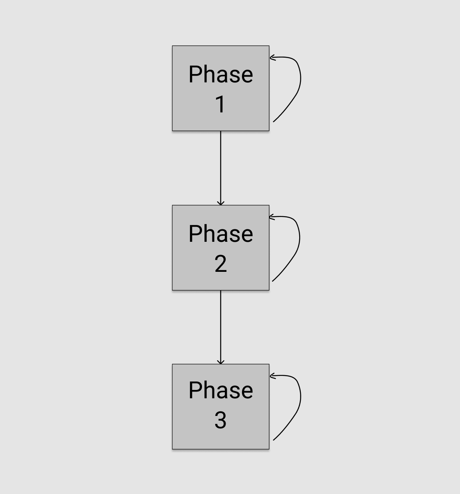
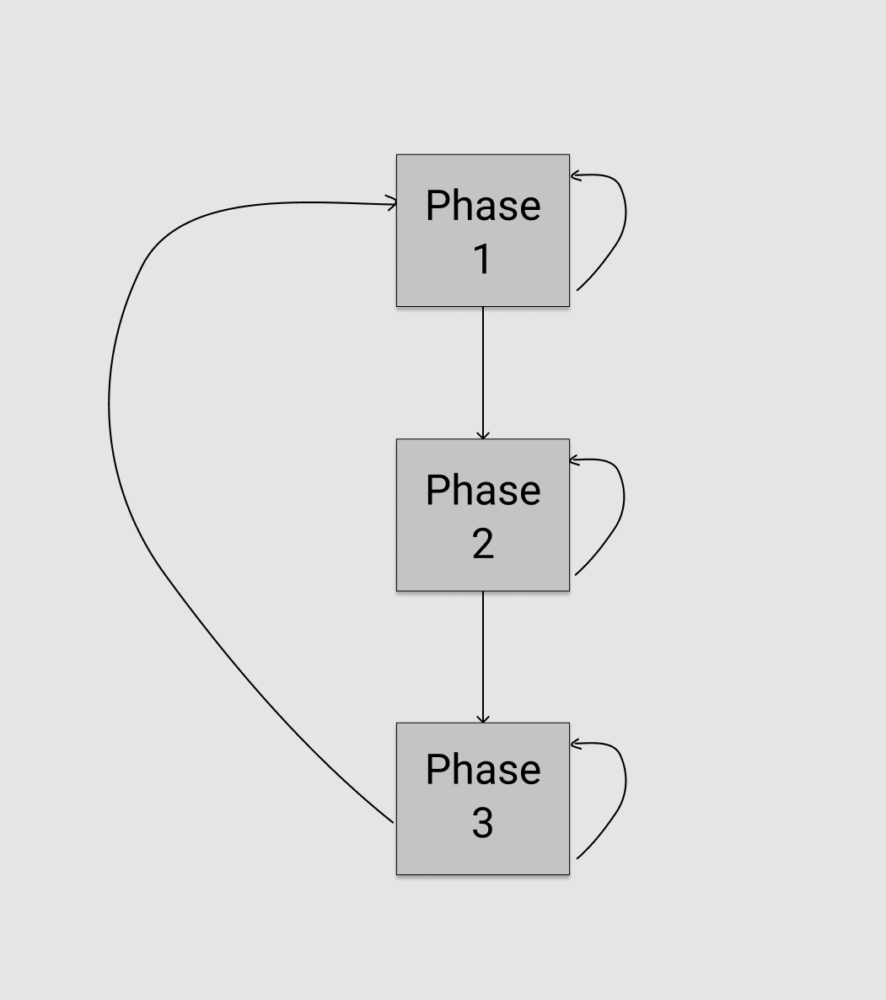
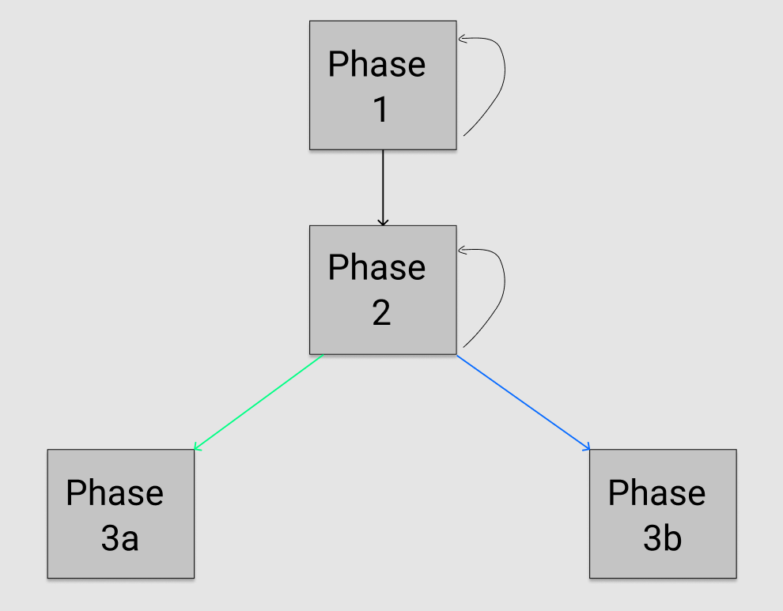
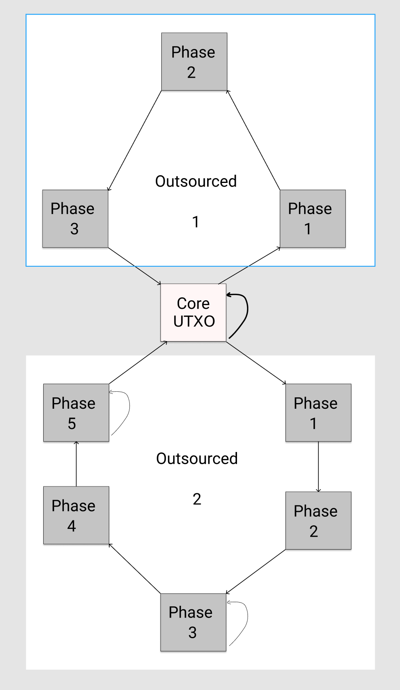

# High Level Design Patterns In Extended UTXO Systems

- Author: Robert Kornacki
- Released: June 9 2020
- Topics: Smart Contracts, UTXO-Model, Design Patterns, Automata

Introduction
---

Extended UTXO (unspent transaction output) systems enable full fledged [Turing complete](https://arxiv.org/abs/1806.10116) (across transactions) smart contracts. This is a novel innovation that allows the latest generation of blockchains to reclaim the original model that Bitcoin used, but now with a lot more power.

Given its newness, UTXO lacks design patterns which developers can rely on when building dApps. In fact, UTXO code differs from that of account based systems like Ethereum much like imperative coding differs from functional.

That said, UTXO protocols have a direct correlation with State Machines. Basic protocols rely on a simple state machine which transitions from state to state across transactions with only a single UTXO carrying the data/coins. More complex protocols however are made of more than a single state machine with certain state transitions requiring two or more state machines to converge. During this convergence the data/tokens within the current state of each state machine are used as input to transition both forward. These convergence-based transitions may result in full convergence where they join into a single state machine or partial convergence where they only use each other as inputs and still continue separately parallelized. 

Further, it is possible for a state transition to generate a whole new and parallelized state machine that will function on its own. This can happen during a convergence of state machines or merely in running of a single one. This new facet is where much of the novel complexity originates from.

This document summarizes several UTXO-based smart contract design patterns at the highest level, thereby abstracting out any blockchain-specific details. Any smart contract powered extended UTXO system which provides the ability to read the coins, data, and the address (contract/contract hash) of both inputs and outputs should be able to use all of the following design patterns. These patterns start out relying on a single state machine and progress into the realm of multi-state machine protocols with convergence and new state machine generation.

Terminology
---
##### Contract/Script
The code which locks a UTXO on-chain that must evaluate `True` to spend said UTXO.

##### Smart Contract Protocol
One or more on-chain scripts/contracts which together define a dApp.

##### Phase/Stage
A specific state in the smart contract protocol.

##### Spending Path/Action
An action a user can take in a given phase/stage to progress to the next phase (or recurse into the current one), which is also known as a spending path.

Linear Protocols
---
Linear protocols allow an actor to recurse back into the same stage/phase which they were in or progress forward into the next stage.

Not all linear protocols require each (or even any) of the phases to recurse/repeat.  Some may only have a single path which takes a user straight from phase 1 -> phase 2.

The mockup below is an illustration of a linear protocol where all phases have both paths.

Once the UTXO is under the final phase it may have a path back to itself (as can be seen above), but it also must have a spending path that allows it to be arbitrarily spent. This can be considered the “exit path”, which is how the protocol officially concludes and thereby makes data/funds available for use arbitrarily by whichever party that has the right do so according to the protocol.

This path approach is generalizable. For example, any protocol which requires an accumulation period that isn't parallelized for either funds or data will be a linear protocol. This protocol can work for participant registration, casting votes, or acquiring oracle data.  It will also work for anything that builds up data/funds which then get passed onto the core protocol in subsequent phases. This allows for a clean separation between setup and running the protocol itself.

Recursive Protocols
---
Recursive protocols build on linear protocols and allow for more complex logic. Each phase in a recursive protocol can either spend into itself or into the next phase as with linear contracts. However the final phase contract also has a spending path back to a prior phase. This means that the protocol restarts at the previous phase but this time with new accumulated data gathered along the way. This maps onto classic recursion quite clearly.

As typical of recursion, there must be a conditional statement that allows for exiting the recursive looping. At least one of the phases must have an exit path provided some set of conditions is met.  Because there is always an exit path, recursive protocols can serve as a segment of a larger, linear protocol. 

The illustration below shows a very simple recursive protocol which has a recursive path back to phase 1 from phase 3.

We can demonstrate the uitility of recursive protocols to solve the problem of front-running in on-chain dApps. Front-running happens when a bad actor like a blockchain node observes an incoming transaction that would receive rewards and inserts or 'front runs' its own transaction ahead of it. 

For example, let's say we have an award locked in an on-chain math problem. If someone figures out the answer, they post it on-chain and get the award.

To prevent front-running, we have two phases in our protocol which recurse.
- Phase 1: Answer Hash Submission
- Phase 2: Answer Reveal

In phase 1, there is only one spending path. Anyone can spend the UTXO into phase 2, but they must provide a hashed answer (rather than the clear text answer).

Once the UTXO enters into the phase 2, the user has officially “locked in” an answer. The user now has an answer period (some predefined number of blocks to prevent stalling) to submit the answer during phase 2. When provided, the answer will be first hashed on-chain to verify that it matches the hashed answer the user provided in phase 1, and then it will be used as input into the mathematical function to see if it is indeed the answer to the unsolved problem. If both of these conditions evaluate to true, then the exit path is followed and the user can withdraw the bounty funds. If no one provides the hash and correct answer during the “answer period”, that phase expires and anyone can spend the UTXO by recursing it back into phase 1. 

As such we have a system that prevents front-running of answers for locked funds on a public blockchain via a recursive protocol.

Branching Protocols
---
A branching protocol allows for any phase in the protocol to converge towards two or more different phases. This can be understood as essentially being an OR gate.

From phase 1 in a protocol a user has the ability to spend the UTXO into either phase 2a, phase 2b, or phase 2c. Therefore this also means that there may be several distinct exit paths from the protocol. 

The illustration below displays a branching protocol with two branching paths, 3a and 3b. Both 3a and 3b have their own exit paths out of the protocol.

It is also possible for a protocol to recurse on itself, becoming a recursive branching protocol. In fact, a branching protocol can have only a single path recurse back rather than all paths. For the above mockup example this would mean that phase 3a would be able to recurse back to phase 1, while phase 3b would be the sole exit path out of the protocol.

Branching protocols can be useful when the decisions of actors taking part in the protocol require different resulting states.

Parallelized Protocols
---
As we saw in the previous section, branching acts as an OR path, meaning that only one output UTXO from the spending transaction is created. In contrast, parallelized protocols act as an AND path where 2 or more output UTXOs are generated each in its own stage/phase. These parallelized UTXOs can then converge back together once they have performed all of the required computations for a new consolidated state of the protocol.

This allows for multiple actors to perform actions in the same instance of a protocol in the same block, thereby increasing the “throughput” of the specific protocol. This also makes transactions cheaper for each party if the state was split between the parallelized UTXOs since the transaction size is smaller.

The illustration below shows how parallelized protocols work. Note that phase 3a and phase 3b both are created at the same time and run in parallel. The state is unified back into phase 5 once both parallel paths conclude (which may end up being asynchronous).

As an example of parallelized protocols, let's consider a highly complex protocol that would normally be too expensive to run on a public chain.   Let's say it runs on an enterprise side-chain that has high throughput and cheaper transactions.

Four actors wish to run a small rock-paper-scissors tournament on-chain with an entry fee. Rather than waiting for each match to finish one after another, they intend to split the group in half and have two matches at the same time. The winner of each group faces the other to decide the champion who can withdraw the locked funds.

The contact is split into three phases:
- Phase 1: Entrant Registration
- Phase 2: Parallelized Matches
- Phase 3: Final Match

Phase 1 allows anyone to join the tournament by spending the phase into itself and adding funds equivalent to the entrance fee to the resulting UTXO.

One of the four actors creates the phase 1 UTXO and includes their entry fee. The other three actors spend the UTXO in succession and thereby add themselves to the entrant list. Now that all four entrants have registered, the spending path to start the parallelized matches, phase 2, is now open.

One of the participants spends the UTXO into phase 2, which means that two new UTXOs are generated. From the original list of participants, two are selected to be put into the first parallelized UTXO, and two into the other. 

Each parallelized UTXO performs a best 2 out of 3 sub-protocol separately. We will abstract out the game protocol as it isn’t vitally important to the topic at hand, but suffice to say it can be pretty easily (though inefficiently) implemented with both entrants locking hashes of their move (with a salt or nonce added in) for a first phase and then revealing the answers/deciding the winner in the second phase. This can be modeled with a recursive protocol whose exit path relies on being spent with the other parallelized path to unify the data back into phase 3 of the whole protocol.

Once the protocol has arrived at phase 3, the winners from the parallelized matches play a final match. In this case, however, the exit path is allowed to be spent by the the winner of the match who will be able to withdraw all of the prize funds).

As such we have parallelized the matches within an on-chain tournament and unified the state back into a single UTXO for the conclusion of the protocol. This example could be scaled up to a 5000 person tournament (or more), as the limits rely on the blockchain’s throughput limit.

Parallelized protocols can extend beyond on-chain tournaments and are a good option for when there are many actors who perform actions at the same time. The protocols also work for separating data from computation into separate UTXOs which cuts can reduce transaction fees.

Outsourced Computation Protocols
---
Outsourced computation protocols are similar to parallelized protocols however they keep the core state in a single UTXO with an unchanging phase/stage. 

Instead of splitting the state into 2 or more outputs in their own phases which then converge back together, outsourced computation protocols create “outsourced” UTXOs which run their own sub-protocols. Once the sub-protocols finish and reach their end-state, the resulting data goes through the exit path back to the core UTXO, and the main contract state is updated.

This can be useful for protocols that expect to have a non-ephemeral/permanent core state which needs to be alive/accessible at all times.

Any computations that are multi-step/require several actors to provide input are a great candidate to be outsourced. These outsourced computations can be any of the above described types of smart contract protocols, allowing for combining/embedding several sub-protocols together into one larger protocol. The key difference for these sub-protocols is that their exit path must be back into the core UTXO (not being arbitrarily spent as was previously the case).

Theoretically this design pattern could also be used for moving very complex/long protocols into side-chains (or state channels) in cases where you still want a single global state held by the main UTXO/script on mainnet.

The illustration below demonstrates an outsourced computation protocol. The center box is the “core UTXO”, the main UTXO of the protocol which holds the core state of the protocol. This core UTXO must always spend into itself, and may also spend into one of the outsourced computation paths as well. Note that there are two possible outsourced computation paths, the first being a linear sub-protocol comprised of 3 phases, the second being a liner sub-protocol comprised of 5 phases.

Outsource computation protocols potentially make it easier for new developers to get started creating their own smart contract protocols. They can define their protocol state which will be held in the core UTXO, and then plug-and-play protocols others have written as outsourced sub-protocols which do all of the computation. This way the developer merely needs to put the pieces together to build brand new protocols, kind of like using libraries when writing classical programs.

Note: In existing UTXO systems, the core UTXO will need to hold an NFT in order to distinguish itself from other UTXOs created by others locked under the same contract/at the same address. Otherwise bad actors can fool users into using the wrong UTXO with a different state.

Conclusion
---
Traditional account based smart contract platforms like Ethereum lack the notion of transaction path which makes it hard for dapp developers to avoid vexing problems such as front running, high expense, and low throughput.

In contrast, UTXO protocols utilize path oriented design patterns - linear, branched, recursive, outsourced and parallelized, that make it easy for the dapp developer to create reliable and high performing alternatives.
  
