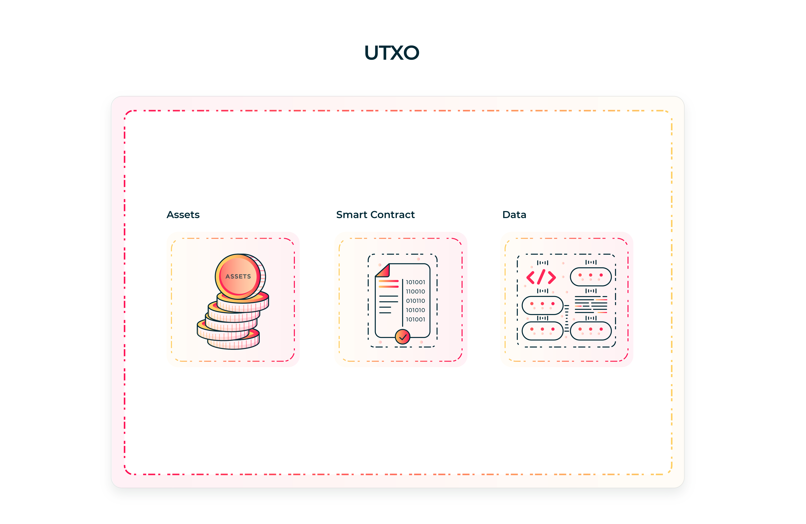
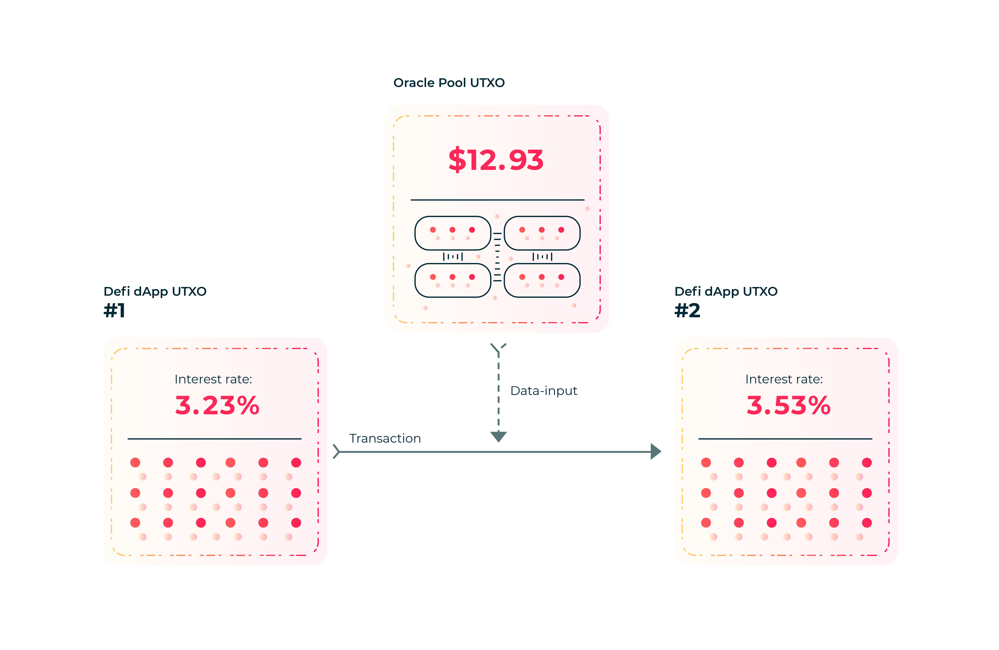

# Unlocking The Potential Of The UTXO Model

- Author: Robert Kornacki
- Released: September 14 2020
- Topics: Smart Contracts, UTXOs, Data-Inputs, Scaling, Contract Updates, Context Claims

Introduction
---

The extended UTXO model empowers smart contract writers with a robust and flexible base to build on top of. In contrast to the account model, UTXO-based smart contracts have no concept of a function which you call within a transaction in order for state transitions to take place. Instead UTXOs use a much more functional approach where every time one is spent, the old UTXO is destroyed and a new output is created.

In this process of spending a UTXO, the smart contract executes in order to verify that this transaction is valid. Thus rather than looking at smart contracts as autonomous entities which act, it is much more valid to consider them as guards who mandate truthful & accurate execution.

While a little bit counterintuitive, this is in fact a very useful distinction. Rather than having an unscalable mess of a system which is trying to achieve the impossible goal of "becoming a world computer", we can instead be realistic and optimize the design of smart contracts to make them as scalable and powerful as possible.

By being clear in our expectation of what smart contracts are meant to do, we also unlock the ability to discover new untapped potential. This is what is offered to us by the extended UTXO model.

In this write-up we will touch upon a number of such new innovations that are only possible thanks to the concept of data-inputs on UTXO systems.

How Do UTXO Contracts Work?
---
In the introduction we quickly skimmed over UTXOs at a high level. This is fine if one is already well versed in the area, however for the majority of readers it can be quite abstract and challenging to wrap your head around. As such, let's break this down to basics and work our way up from there to novel innovations.

A UTXO stands for Unspent Transaction Output. At a very high level, each UTXO(also known as a box) on an extended UTXO system is comprised of:
1. The assets inside.
2. The smart contract(script) that locks the UTXO. (Or the hash of the contract for P2SH)
3. On-chain data held in the box which is relevant to the smart contract.

Depending on the blockchain at hand there may be other kinds of data held in the UTXO as well (ex. metadata). These differences however don't typically impact the expressiveness of the model itself, and as such are not considered in this writeup.

In existing blockchains (Ergo, Cardano), the smart contract that a UTXO is locked under is defined by the address. As such, `UTXO A` is locked by `smart contract Y` if `UTXO A` is sent to the address `smart contract address Y`. The address is typically either the hash of the contract (for P2SH addresses) or a serialized form of the contract (for P2S addresses).

When a UTXO at `smart contract address Y` is used as an input in a transaction, the code/logic within `smart contract Y` is executed to determine whether or not the transaction is valid. During execution the smart contract typically reads:
- The assets held in the UTXO.
- The attached data within the UTXO.
- Assets/Data/Contracts of the other inputs in the transaction.
- Other context of the current transaction.

The smart contract reads the above listed data as input and if it executes to the equivalent of `True`, then the transaction is valid and passes. This is the core workflow which UTXO-based smart contracts use.

What this means is that every time you wish to update data held by a dApp (inside of a UTXO), you must spend the original UTXO (thereby destroying it) and create a new UTXO at the same address & holding the same assets. This new UTXO however has a new value in it's data, thereby causing a state transition to happen from the old data value(s) to the new data value(s).

Each UTXO holds it's own personal state in the data it has attached to it. As the data and assets move from one UTXO to another, they pass through state transitions which can cause them to split, accumulate, be deleted, or be used with other assets/data from other UTXOs. These higher-order actions allow for more complex logic to be encoded with potential for multiple input UTXOs and multiple output UTXOs. This ends up being one of the key basic building blocks for developing dApps.

Basic Cross-Contract Interoperability
---
As we have seen, spending UTXOs is at the core of the extended UTXO smart contract model. All execution happens when a UTXO is spent.

The astute reader may have already noticed that since we have state(data) attached individually to each UTXO, every time a state transition happens the result is reflected in said data. As such the data often is "preprocessed", wherein it already exists and contains information that could be useful for other dApps/contracts to reference without any further execution required.

An example of useful information that could be used by other smart contracts would be oracle data. Using such data held in a UTXO in a naive manner would entail spending the UTXO. By using the UTXO (that has oracle data) as an input you are spending it and thereby providing access to it's data to your other transaction inputs. This is how your dApp can attain access to data held under UTXOs locked under other smart contracts.

That said, having to spend every single UTXO which you wish to read data from has a number of strong drawbacks:
- The smart contract of the UTXO with the data must execute, thereby increasing computation complexity/cost.
- The UTXO must be spent, meaning only 1 tx can use the UTXO data per block/slot.
- Tx fees increase due to needless excess execution & recreation of the output data UTXO.
- Every UTXO which wishes to allow read access through spending must encode the logic directly within their smart contract.
- Is liable to spam attacks by bad actors who wish to wreak havoc on a protocol.
- Increased off-chain complexity in tx creation & finding latest UTXO.

The above negatives make it clear that a new approach needs to be taken in order address said issues. Reading data across UTXOs/dApps is a very common design pattern that will be required when implementing protocols of significant complexity.

Data-Inputs As A Powerful Solution
---
Thankfully an extremely useful innovation was figured out by the core Ergo developers, [
Alexander Slesarenko](https://github.com/aslesarenko), [Alex Chepurnoy](https://github.com/kushti), and [Dmitry Meshkov](https://github.com/catena2w) while building the [very first UTXO-based smart-contract powered Blockchain](https://ergoplatform.org/en/).

Rather than forcing all transaction to destroy/spend all inputs as is the norm in historic UTXO-based Blockchains, what if we instead brought in the concept of "read-only inputs"? These would allow any transaction to reference any other box(UTXO) currently in the UTXO-set and read the data held in it without any of the problems listed in the previous section.

This is exactly what *data-inputs* are.

No smart contract execution occurs because the box is not being destroyed/spent. This means that a given UTXO can be read by every single tx in a block/slot in parallel as none of them consume the data but instead all share a reference to it. Transaction fees decrease due to no contract execution and no extra output needing to be created. All further negatives are addressed as well, making data-inputs a clear design choice that all UTXO-based blockchains should implement.

As can be seen in the diagram above, data-inputs are a prime mechanism for many use cases such as DeFi. In this diagram the interest rate of our DeFi dApp relies on external oracle data from the real world. The DeFi dApp uses an Oracle Pool in order to fetch said data, which in our case is `$12.93`.

This is the market price of an asset in the real world, and is accessed by the DeFi dApp via a data-input. The UTXO of the Oracle Pool is referenced within the data-input section of the transaction, and as such the data becomes available to our DeFi dApp smart contract.

During the state transition (spending transaction) which updates the state of our DeFi dApp we can see that the oracle data was used to perform an interest rate calculation. The original interest rate was `3.23%` but after reading the Oracle Pool data, the interest rate was updated to `3.53%`.

This is the basic process of how data-inputs work in practice. In our example above we only show a single dApp referencing the Oracle Pool UTXO as a data-input. However potentially 1000's of DeFi dApps could do just the same for their own use within the same block/slot (assuming blockchain throughput supports it).

Unlocking The Potential Of Data-Inputs
---

Now that we've touched upon what data-inputs are and what kind of benefits they provide at a base level, let's browse through some of the truly novel innovations they empower a UTXO-based Blockchain with:

### 1. Scaling dApps By Parallelizing On-Chain Computation
One of the key new tools offered by data-inputs on UTXO systems is concurrency and parallelism.

Rather than all actions within a dApp being done sequentially in the same contract/UTXO, it is instead possible for actors in a protocol to perform their portion of the protocol entirely in their own UTXO(s). This means that they have no direct reliance on the sequential (and thus potentially blocking) operations of others thereby increasing the throughput of the given dApp at hand.

Once an actor has finished their portion of the protocol, the resulting UTXOs generated from it can either be spent or read. The former allows complex protocols with distinct actors who provide both data and assets to take part in parallel, and then have their UTXO consumed back into the core protocol. This can be useful for things such crowdfunding or on-chain tournaments for example. For tournaments, multiple users play matches in parallel, and their results & staked funds get consumed/converge back together after the rounds have finished (this is a naive but explanatory example).

On the other hand the latter, reading UTXOs, allows for a lot more power to be unlocked thanks to data-inputs coming into the picture. By reading data which has been generated in parallel, it means that this data is acquired for cheaper, can be reused by others, and is accessible to everyone at the exact same time. Thus we unlock impressive potential such as having multi-stage smart contract sub-protocols running in a dApp which execute completely in parallel yet access each others' data in order to perform checks/guarantees that everything is in order.

Furthermore since the data from all of UTXOs running in parallel is accessible via data-inputs we have the ability to take "snapshots" of the state of a fully parallelized dApp. Rather than having these parallelized UTXOs be blocked or waiting for actions to occur in the core state of the protocol in order for said UTXOs to be further spent/used, they can continue their portion of the protocol without any problems. Afterwards snapshots are generated by actors on the blockchain who are incentivized/paid by the dApp to find all protocol-related UTXOs. Once found within the UTXO-set on the blockchain, these "accumulators" reference all of these UTXOs as data-inputs and accumulate them together into a final value representing the current state of the protocol.

As such, we have a viable concurrency model on extended UTXO blockchains which is further made more powerful thanks to data-inputs.

### 2. Seamless dApp Updates In The UTXO Model
Data-inputs also enable seamless updating of multi-stage UTXO-based dApp protocols via the use of proxy boxes.

By having proxy boxes which holds either the computational logic of a given stage in a protocol, or the address of the next stages which can be spent into, we have an outsourced UTXO which provides the ability for us to update our dApps.

This outsourced proxy UTXO will implement a governance scheme which allows for updating the underlying script which locks it, and/or the data in its registers which contain the addresses of following stages. This can use a multi-signature scheme, a token-based voting scheme, or any other governance protocol in order to issue updates to the dApp.

This opens up the door for dApps that have governance tokens to be self-updatable by the community that governs the protocol. If a super majority votes to update `Stage X` from `Contract A` to `Contract A'`, then this will be reflected in the proxy box and as such will effect all future actions/state transitions in the dApp.

The flexibility of how dApp updates are implemented via proxy boxes is thanks to data-inputs providing us with an outsourced UTXO which contains all of this logic outside of our core dApp protocol itself.

### 3. Efficient & Trustless Global Context Claims
Since anyone and everyone on the Blockchain has access to data stored in any UTXO as data-inputs, we can make efficient claims about the state of **any dApp** trustlessly.

This means that without developers providing explicit permission by encoding extra logic (which would increase computation cost) or having to do any extra work, users on the Blockchain can access the current state of any dApp within their own contracts.

As an example, we can make claims that dApp X does not have more than $100,000,000 in liquidity and put a bounty up for anyone to disprove said claim. What this means is that while our UTXO which makes this claim exists, we can treat it as an invariant that said claim is true. This can then be built off of as a building block in more complex protocols.

*Claim checkers* will constantly scan the UTXO-set to verify that dApp X does not have more than $100,00,00 in liquidity. If dApp X does eventually get to that point, then all of the claim checkers will rush to spend the claim UTXO in order to earn the bounty. This would then signal that our claim/invariant was disproved, and as such we have an interactive mechanism for efficient global UTXO-set claims for our dApps.

This is an extremely powerful mechanism which was never possible before in any other system prior. It opens up the doors for many intriguing use cases, such as permisionless dApp insurance, or permisionless/trustless prediction markets about the state of *any* dApp on the entire Blockchain. These are just a couple of interesting possibilities with major implications, however undoubtedly there are more more yet to be discovered.

Conclusion
---

As can be seen, there is huge potential unlocked thanks to the great innovation of data-inputs on extended UTXO-based Blockchains. The points touched on above are meant to give a taste of what is possible without diving in too deep into technical details.

Further Emurgo Research write-ups will be released in the future which go in depth on all of these innovations and potentially more as they are discovered.

